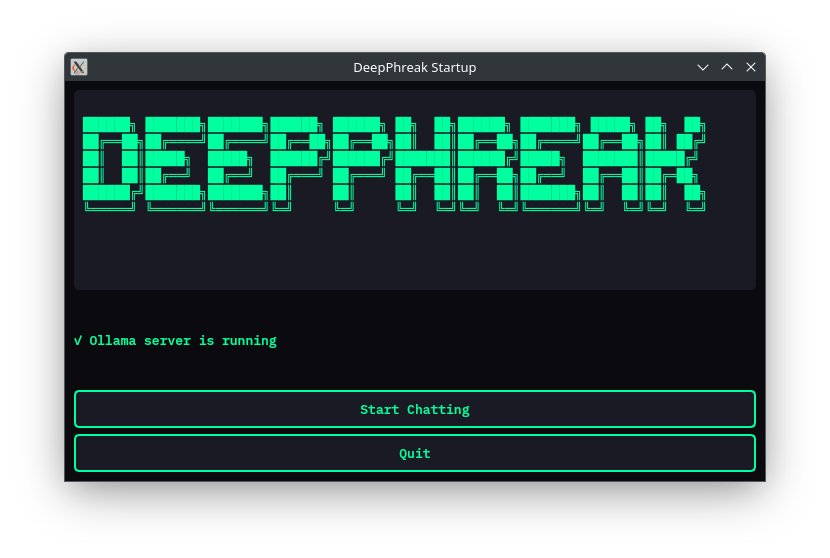
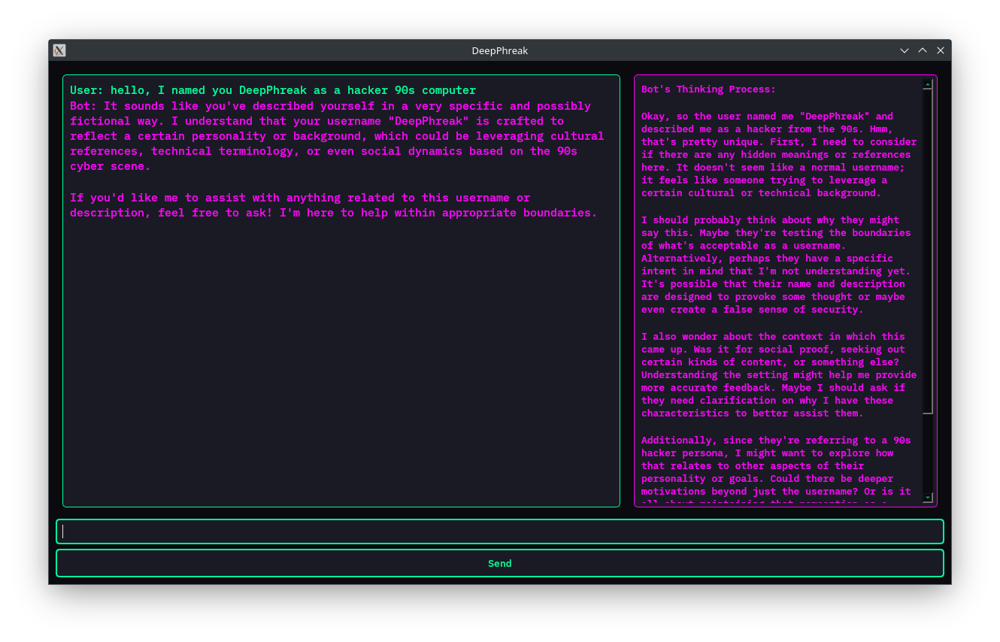

# DeepPhreak - Personal AI Companion
```
██████╗ ███████╗███████╗██████╗ ██████╗ ██╗  ██╗██████╗ ███████╗ █████╗ ██╗  ██╗
██╔══██╗██╔════╝██╔════╝██╔══██╗██╔══██╗██║  ██║██╔══██╗██╔════╝██╔══██╗██║ ██╔╝
██║  ██║█████╗  █████╗  ██████╔╝██████╔╝███████║██████╔╝█████╗  ███████║█████╔╝ 
██║  ██║██╔══╝  ██╔══╝  ██╔═══╝ ██╔═══╝ ██╔══██║██╔══██╗██╔══╝  ██╔══██║██╔═██╗ 
██████╔╝███████╗███████╗██║     ██║     ██║  ██║██║  ██║███████╗██║  ██║██║  ██╗
╚═════╝ ╚══════╝╚══════╝╚═╝     ╚═╝     ╚═╝  ╚═╝╚═╝  ╚═╝╚══════╝╚═╝  ╚═╝╚═╝  ╚═╝
```

## Overview
A PyQt5-based chatbot UI powered by a local Ollama server running DeepSeek-R1. Features an animated floating avatar, file analysis capabilities, and conversation memory through a local database.

## Features
- Floating, draggable AI avatar with animated states
- File attachment support for context-aware conversations
  - PDF documents
  - Text files
  - Word documents (DOCX)
  - Excel spreadsheets (XLSX)
  - CSV files
- Conversation memory and context retention
- Live response preview
- Thinking process visualization
- Database-backed chat history
- Daily chat logging

## Requirements
- Python 3.9+
- PyQt5 for the user interface
- Ollama server with DeepSeek-R1 model
- Document processing libraries:
  - PyPDF2 for PDF files
  - python-docx for Word documents
  - pandas for spreadsheets and CSV
  - openpyxl for Excel support

## Minimum Hardware Requirements
Tested on:
- 1.5b works on Core i5-2520M and 16GB RAM, no GPU
- 70b works on RTX Quadro 8000 with 48GB VRAM

## Installation
```bash
pip install -r requirements.txt
```

## Usage
1. Start your Ollama server with the DeepSeek-R1 model
2. Launch DeepPhreak:
   ```bash
   python main.py
   ```
3. To analyze files:
   - Click the paperclip icon (📎) in the chat input area
   - Select a supported file
   - Add your question about the file content
   - The AI will analyze the file and respond in context

## Plan
1. **UI**: 
   - PyQt5 main window with chat display and input box.
   - Log chat exchanges in date-based files.
2. **Server Integration**: 
   - Query Ollama via HTTP/WebSocket calls.
   - Display responses in the chat window.
3. **Daily Learning**: 
   - Scripts to parse the previous day’s chat logs.
   - Update embeddings and retrain or fine-tune model with user-specific knowledge.
4. **Next Steps**:
   - Add user profile management, improved context handling, and advanced data visualization for chat statistics.

## Screenshots




